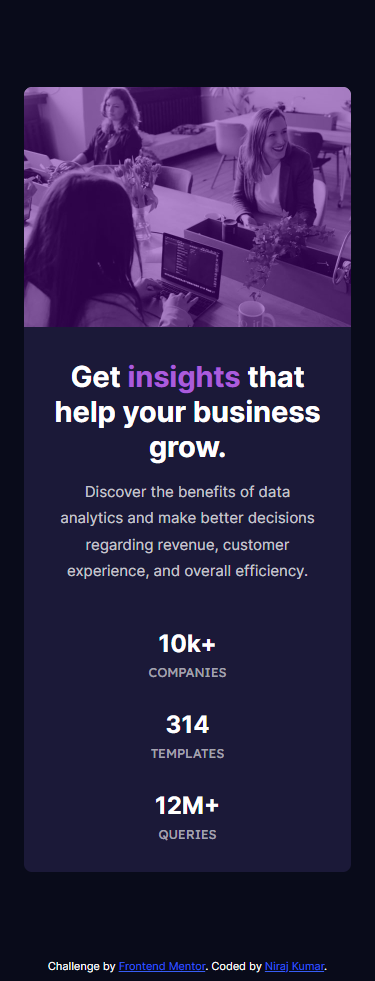

# Frontend Mentor - Stats preview card component solution

This is a solution to the [Stats preview card component challenge on Frontend Mentor](https://www.frontendmentor.io/challenges/stats-preview-card-component-8JqbgoU62). Frontend Mentor challenges help you improve your coding skills by building realistic projects. 

## Table of contents

- [Overview](#overview)
  - [The challenge](#the-challenge)
  - [Screenshot](#screenshot)
  - [Links](#links)
- [My process](#my-process)
  - [Built with](#built-with)
  - [What I learned](#what-i-learned)
  - [Useful resources](#useful-resources)
- [Author](#author)


## Overview

### The challenge

Users should be able to:

- View the optimal layout depending on their device's screen size

### Screenshot





### Links

- Solution URL: [Add solution URL here](https://your-solution-url.com)
- Live Site URL: [niraj-stats-preview-card](https://niraj-stats-preview-card.netlify.app/)

## My process

### Built with

- Semantic HTML5 markup
- CSS custom properties
- Flexbox
- Mobile-first workflow

### What I learned

- I learnt how to show completely different images, depending upon the device width, using the .

```css
<h1>Resize Window</h1>
<picture>
  <source srcset="https://via.placeholder.com/1400" media="(min-width: 1400px)"/>
  <source srcset="https://via.placeholder.com/1200" media="(min-width: 1200px)"/>
  <source srcset="https://via.placeholder.com/800" media="(min-width: 800px)"/>
  <source srcset="https://via.placeholder.com/600" media="(min-width: 600px)"/>
  
</picture>
```
- 
Use this section to recap over some of your major learnings while working through this project. Writing these out and providing code samples of areas you want to highlight is a great way to reinforce your own knowledge.

To see how you can add code snippets, see below:

```html
<h1>Some HTML code I'm proud of</h1>
```
```css
.proud-of-this-css {
  color: papayawhip;
}
```
```js
const proudOfThisFunc = () => {
  console.log('🎉')
}
```

If you want more help with writing markdown, we'd recommend checking out [The Markdown Guide](https://www.markdownguide.org/) to learn more.

**Note: Delete this note and the content within this section and replace with your own learnings.**

### Useful resources

- [Stackoverflow](https://stackoverflow.com/) - This really helped me. It has become my go to place for any problem I face, I just google it and this is always the first result and more often than not, it is pretty accurate too, since, someone out there faced the same problem as me and has already asked it here most of the times.

- [W3 schools](https://www.w3schools.com/) - This is an amazing site, which has pretty good explainations, with proper syntax, on most css properties.

- [MDN Docs](https://developer.mozilla.org/en-US/docs/Web/CSS) - This is the end, all be all of CSS, if you can't find find it here, you haven't looked properly😜.

## Author

<!-- - Website - [Add your name here](https://www.your-site.com) -->
- Frontend Mentor - [@niraj-kumar-r](https://www.frontendmentor.io/profile/niraj-kumar-r)
- Twitter - [@niraj_kumar_r](https://twitter.com/niraj_kumar_r)